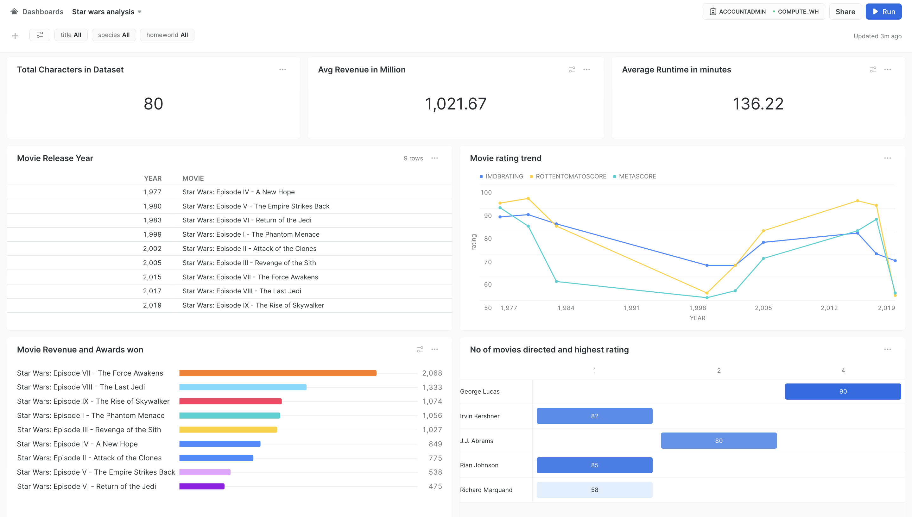

# May the 4th be with you: Exploring the Star Wars Universe with Snowsight

### Overview
This project contains the files used to create the Snowsight dashboard for exploring data related to the Star Wars universe. 
This project demonstrates how Snowsight can be used to create a dashboard for exploring data related to the Star Wars universe.
The dashboard includes a number of visualizations, such as bar charts,line charts, scatterplots and heatmaps, that provide insights into various aspects of the Star Wars franchise.

### Prerequisites

Before you begin, you'll need to have the following:

- A free trial account on Snowflake. You can sign up for one [here](https://signup.snowflake.com/).

### Data sources
The data used to create this dashboard was sourced from kaggle and data.world

### Dashboard Screenshot

